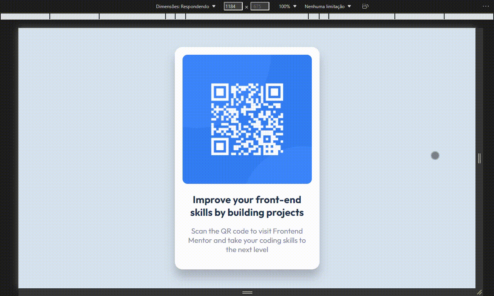

<h1 align="center">QR Code Component</h1>

## 📚 Sobre o Projeto

Desenvolvido com base no [design](https://www.frontendmentor.io/challenges/qr-code-component-iux_sIO_H) proposto pelo site [Frontend Mentor](https://www.frontendmentor.io/home).

## 🔎 Demonstração

  

## 🖥️ Como acessar

A aplicação está hospedada no **GitHub Pages** e pode ser acessada [aqui](https://riandeoliveira.github.io/qr-code-component/).

## 🛠️ Tecnologias utilizadas

  <h3>Front-End</h3>
  </img>
  &nbsp;
  </img>
  &nbsp;
  </img>
  &nbsp;
  </img>
  &nbsp;
  </img>
  &nbsp;
  </img>
  &nbsp;

## 🚀 Desenvolvido em

27 de jan. de 2022

Made with 💙 by <a href="https://github.com/riandeoliveira"><strong>Rian Oliveira</strong></a>

